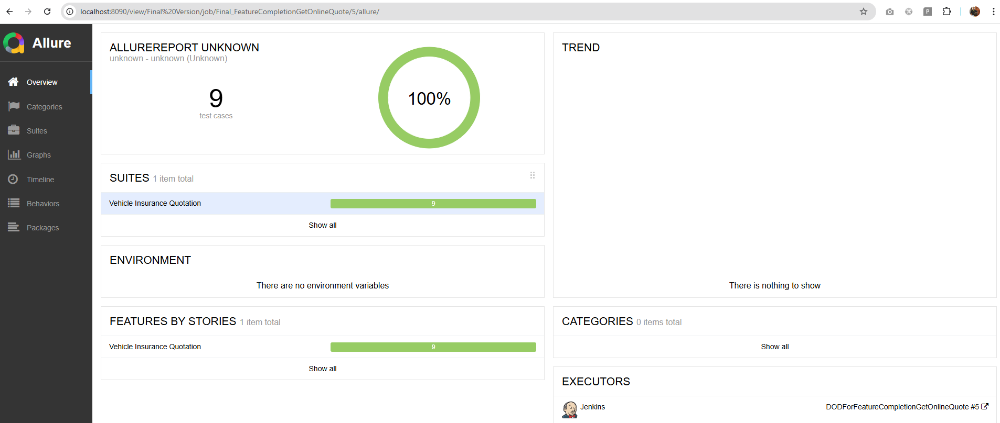

# 🚀 BDD Hands-On Training Session: Vehicle Insurance Quotation App
This project was bootstrapped with [Create React App](https://github.com/facebook/create-react-app).
This repository contains the source code and test automation setup for a hands-on Behavior-Driven Development (BDD) training session. Participants will experience a full end-to-end BDD workflow across business, development, and test disciplines.

---

## 🧭 Project Overview

This app mimics a **Vehicle Insurance Quotation Flow** and is designed to demonstrate how BDD can drive development, collaboration, and quality.

### 💡 Functional Areas Covered:
- Vehicle Information Entry
- Vehicle Usage Profiling
- Driver History Submission
- Policy Customization & Summary

---

## 🛠️ Tech Stack

- **Frontend**: React.js
- **Test Framework**: Cucumber.js + Playwright
- **Runner**: `npx cucumber-js`
- **CI Compatibility**: Designed for Jenkins/GitHub Actions

---

## 🚦 Getting Started

### 🧾 Prerequisites
- Node.js v23.10+ recommended (v23.10+ tested)
- Git
- Visual Studio Code (with Gherkin plugin)

```bash
node -v
npm -v
```

---

### ⬇️ Clone & Install

```bash
git clone https://github.com/nalintrade/bddsession.git
cd bddsession
npm install
npm start
```

Visit: [http://localhost:3000](http://localhost:3000)


---

## 🎯 Hands-On Session Breakdown

### ✅ Step-by-Step Workflow

| Step | Activity | Outcome |
|------|----------|---------|
| 1 | Clone repo & setup | Local dev & test environment ready |
| 2 | Sprint Planning | Choose a feature and define DOD |
| 3 | Three Amigos | Business, Dev, QA collaborate to write feature |
| 4 | Add Feature File | Feature defined in `.feature` format |
| 5 | Run Tests (Fail First) | CI/CD detects all failing tests |
| 6 | Add Step Definitions | Link Given-When-Then to mock code |
| 7 | Add App Page (V1) | Implement enough to pass 1-2 scenarios |
| 8 | Add App Page (V2-4) | Progressively implement app & pass all tests |
| 9 | Final Review | Showcase green report & BDD value |
| 10 | Retrospective | Review BDD efficiency & improvements |
---
## 🚦 CI setup - Jenkins
### Jenkins pipeline 


### Allure BDD feature dashboard. 

#### Start of the Sprint 0% passing

#### Start of the Sprint 60% passing

#### Start of the Sprint 1000% passing


---

## 🧪 Running the Tests

```bash
npx cucumber-js tests/features/GetOnlineQuote.feature   --import tests/stepDefinitions/*.mjs   --format json:reports/cucumber-report.json   --exit
```

---

## 🧰 Exercises

Each stage of implementation is progressive.

| Version | Exercise | Coverage |
|---------|----------|----------|
| V1 | Vehicle Details | Failing → Partial Pass |
| V2 | Vehicle Usage | Additional Step Definitions |
| V3 | Driver History | More behavior coverage |
| V4 | Add-ons & Summary | 100% Test Pass |

---

## 🧑‍🤝‍🧑 Three Amigos Collaboration

Use BDD **feature mapping cards**:
- 🟡 Story
- 🔵 Rules
- 🟢 Examples
- 🔴 Questions

Format:
```gherkin
Given I am on the vehicle details page
When I enter valid data
Then I should be taken to the usage page
```

---

## 🏷️ Tagging Strategy

| Tag | Purpose |
|-----|---------|
| @smoke | Minimal, critical scenarios |
| @vehicle-details | Tag by page/flow |
| @negative | Edge cases |
| @regression | Full suite for release |

```bash
npx cucumber-js --tags "@vehicle-details and not @negative"
```

---

## 📂 Folder Structure

```
src/pages/           → App UI Pages
tests/features/      → Gherkin feature files
tests/pageObjects/   → Page object models
tests/stepDefinitions/ → Step defs per feature
reports/             → Cucumber JSON reports
```

---

## 📊 Reports (Allure)

```bash
npm install -g allure-commandline
node convertToAllure.js
npx allure generate allure-results --clean -o allure-report
npx allure open allure-report
```

---

## 🤝 Contributing

Feel free to raise PRs or forks to use this as a template for your own team workshops!

---

## 📜 License

MIT — Use freely with attribution.

---

## 🙏 Credits

This hands-on session is designed by **Nalin Goonawardana** as part of a full-day BDD enablement workshop.

---


---

## ⚡ Quick Commands Summary

### 🚀 Start the application
```bash
npm start
```

### ✅ Run BDD Tests
```bash
npx cucumber-js tests/features/GetOnlineQuote.feature \
  --import tests/stepDefinitions/*.mjs \
  --format json:reports/cucumber-report.json \
  --exit
```

### 📊 Generate & View Allure Report
```bash
node convertToAllure.js
npx allure generate allure-results --clean -o allure-report
npx allure open allure-report
```

### 🧪 Run Unit Tests
```bash
npm test VehicleUsage
npm test GetQuote
```
